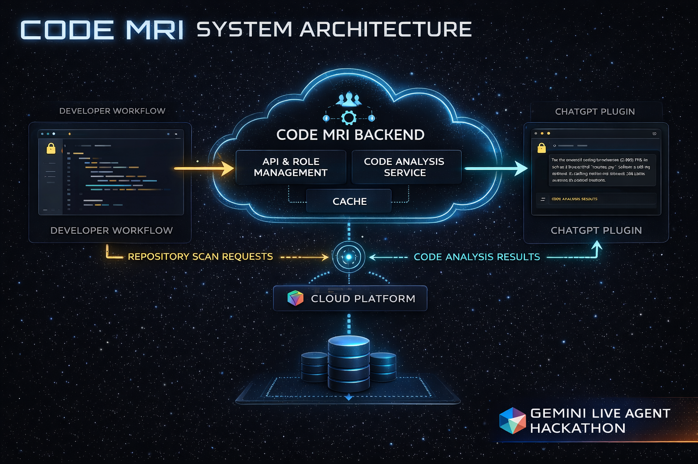
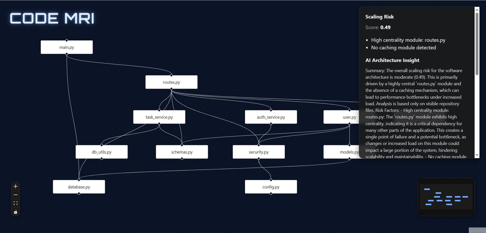

---

layout: default
title: Code MRI — AI-Powered Repository Analyzer
hero_title: Code MRI
hero_subtitle: Understand Any GitHub Repository in Seconds
hero_meta: Built with React · FastAPI · Gemini AI · Google Cloud Run
hero_image: "assets/hero.png"
---

# Code MRI — AI-Powered Repository Understanding

This page explains **what Code MRI is**, **why we built it**, and **how it works**.

The goal is simple: help developers **understand unfamiliar repositories instantly**.

---

## Inspiration

Understanding a new codebase is one of the hardest problems developers face.
When joining a new project or exploring an open-source repository, developers often spend hours navigating folders, reading files, and trying to understand the architecture.

We wanted to solve this problem by building a tool that can **instantly analyze a GitHub repository and explain its structure using AI**.

The idea behind **Code MRI** is similar to how an MRI scan reveals the internal structure of the human body — our system reveals the internal architecture of a codebase.

Our goal is to help developers **quickly visualize, understand, and explore complex repositories without manually reading thousands of lines of code.**

---

## Table of Contents

1. [What it does](#what-it-does)
2. [How we built it](#how-we-built-it)
3. [System Architecture](#system-architecture)
4. [Demo](#demo)
5. [Challenges we ran into](#challenges-we-ran-into)
6. [Accomplishments that we're proud of](#accomplishments-that-were-proud-of)
7. [What we learned](#what-we-learned)
8. [What's next for Code MRI](#whats-next-for-code-mri)

---

## What it does

Code MRI is an **AI-powered repository analyzer** that scans GitHub projects and generates insights about the codebase.

Users simply provide a GitHub repository link, and the system:

* Crawls and analyzes the repository structure
* Builds a **visual architecture graph**
* Identifies relationships between files and modules
* Generates **AI explanations of the codebase**
* Helps developers quickly understand project structure

This dramatically reduces the time required to understand unfamiliar repositories.

---

## How we built it

The system uses a **modern full-stack architecture**.

### Frontend

* Built using **React**
* Provides an interface to submit GitHub repository URLs
* Displays architecture graphs and AI-generated explanations

### Backend

* Built using **Python with FastAPI**
* Handles repository crawling and analysis
* Extracts file structure and relationships between modules

### AI Layer

* Powered by **Gemini AI**
* Generates natural-language explanations of the repository architecture

### Infrastructure

* Backend deployed on **Google Cloud Run**
* Frontend deployed on **Vercel**
* **GitHub API** used to fetch repository information

The backend processes repository data and sends structured information to the AI model, which generates explanations designed to help developers quickly understand the system.

---

## System Architecture

Below is a simplified view of how Code MRI analyzes a repository.

### Pipeline overview

1. The user submits a GitHub repository URL through the React frontend.

2. The request is sent to the FastAPI backend running on Cloud Run.

3. The backend retrieves repository structure using the GitHub API or the crawler fallback.

4. Repository files and relationships are analyzed to construct a structural model of the project.

5. Structured repository data is sent to Gemini AI.

6. Gemini generates explanations that help developers understand the repository architecture.

7. The system combines deterministic code analysis with AI-generated explanations, allowing developers to quickly understand unfamiliar codebases.

---

## Demo

Code MRI allows developers to analyze a GitHub repository and instantly understand its architecture.

### Example Workflow

1. A user submits a GitHub repository URL in the interface.
2. The backend analyzes the repository structure.
3. Code MRI generates an architecture graph and AI explanation of the codebase.

### Example Interface

### Try It Yourself

**Live Application →** [https://code-mri-hackathon.vercel.app/](https://code-mri-hackathon.vercel.app/)

**Source Code →** [https://github.com/paragghosh99/code-mri-hackathon](https://github.com/paragghosh99/code-mri-hackathon)

---

## Challenges we ran into

One of the biggest challenges was **accurately analyzing repository structures**.

Some repositories contain:

* Deep folder hierarchies
* Large numbers of files
* Complex relationships between modules

Another challenge was handling **GitHub API limitations**.
In some cases the API failed or returned incomplete data.

To address this, we implemented a **crawler fallback system** so repositories could still be analyzed even when API calls failed.

We also encountered difficulties in **visualizing architecture graphs** in a way that remained readable for larger repositories.

---

## Accomplishments that we're proud of

* Building a **working AI-powered repository analyzer**
* Deploying a full-stack system using **cloud infrastructure**
* Generating **architecture graphs from real repositories**
* Integrating **AI explanations that simplify complex codebases**

Most importantly, we built a tool that can **save developers significant time when exploring unfamiliar repositories.**

---

## What we learned

During this project we learned:

* How to design **AI-assisted developer tools**
* How to combine **code analysis with generative AI**
* How to build and deploy **cloud-native applications**
* How to visualize complex software architectures

We also gained insights into **how repositories are structured and how AI can help developers understand them faster.**

---

## What's next for Code MRI

We plan to expand Code MRI with:

* **Deeper dependency analysis**
* **Support for multiple programming languages**
* **Security and vulnerability insights**
* **Improved architecture visualization**
* **IDE integrations such as a VS Code extension**

Our long-term vision is to build a platform where developers can **instantly understand any codebase using AI**.

---

*Made with ❤️ by Parag and Pragyendu · Hosted on GitHub Pages*
